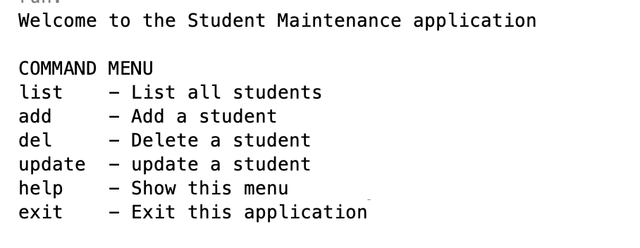
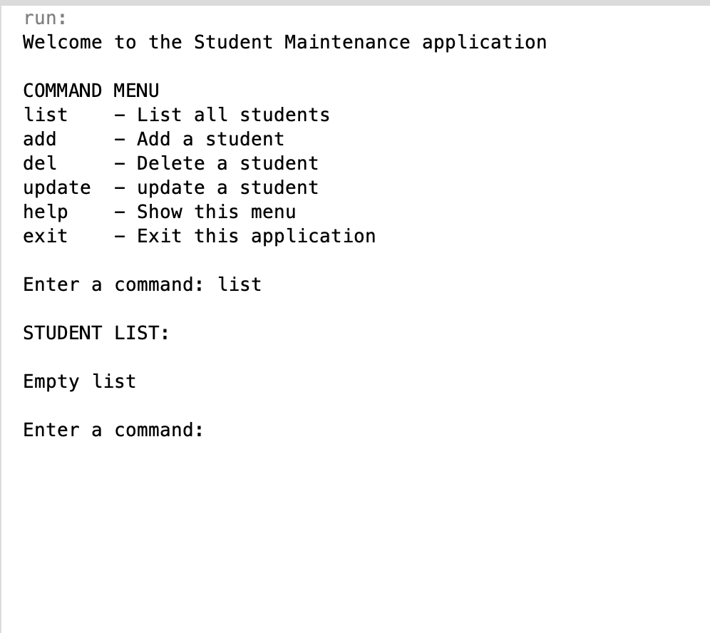
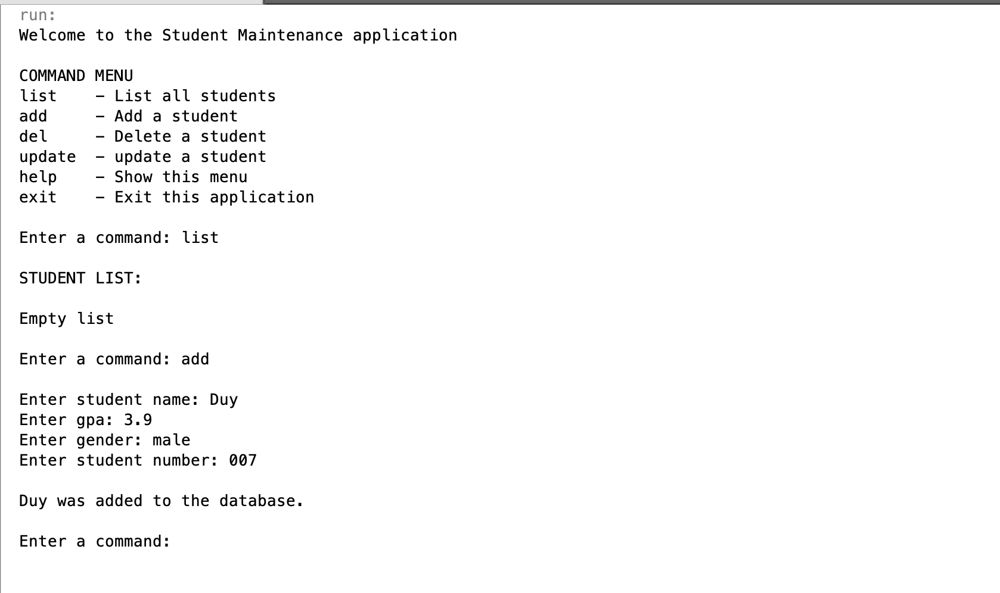
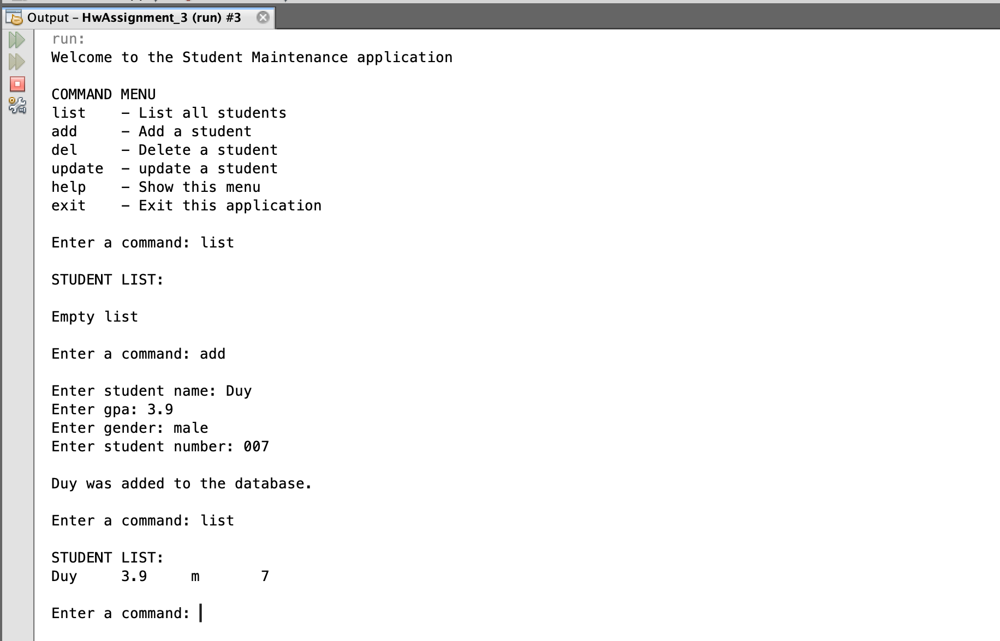
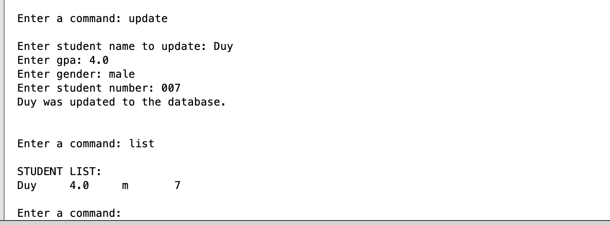
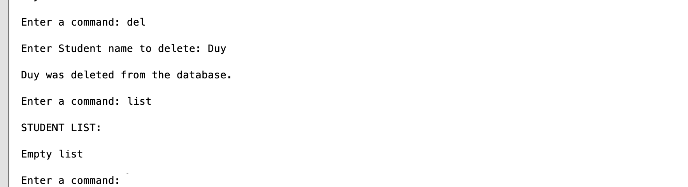

# Student_Maintenance_Appplication

## Introduction

Student Maintenance Apps is a program used to maintain student databases

## Features

1. Control student databases using multiple command
2. Able to list all the student in the database
3. Able to add more student into the database
4. Able to update existing student
5. Able to delete existing student
6. Write all the information into XML file, Using xml stream library to read and write
7. Using interface to achieve multiple inheritance in case of class

## Getting Started

### Installation and setup

1. You need Netbeans IDE for Java to be able to run this program.
2. Clone this repository and import it into Netbeans

### Run

#### 1. Command menu and list

Run StudentMainApp.java and Enter "list" command

For the first time user, There are no students in the database. The result will be a empty list

#### 2. Add and check

 

Enter "add" command and fill out name, gpa, gender and student number

#### 3. Update and check

Enter "update" command and fill out the form

#### 4. Delete and check

Enter "del" command and the student name you want to delete

## Contributing

Pull requests are welcome. For major changes, please open an issue first to discuss what you would like to change.

Please make sure to update tests as appropriate.
